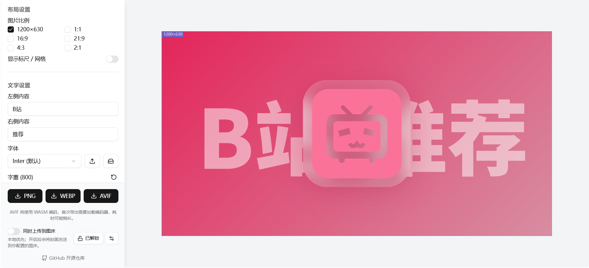

# EasyCoverPlus

[](./LICENSE)
[](https://nextjs.org/)
[](https://www.typescriptlang.org/)
[](https://pnpm.io/)

> **DO U WANT** — 简单、优雅的封面图生成工具。

在浏览器里完成封面设计、渲染与导出。默认纯本地处理；需要时也可把结果上传到你自己配置的图床并拿到链接。

**在线仓库：** [github.com/zylunx/EasyCoverPlus](https://github.com/zylunx/EasyCoverPlus)

---

## 目录

- [特性](#特性)
- [演示与预览](#演示与预览)
- [技术栈](#技术栈)
- [快速开始](#快速开始)
- [使用说明](#使用说明)
- [可选图床上传](#可选图床上传)
- [部署](#部署)
- [与原项目的主要区别](#与原项目的主要区别)
- [项目结构](#项目结构)
- [贡献](#贡献)
- [致谢与许可](#致谢与许可)

---

## 特性

- **纯客户端优先**  
  封面编辑与导出在浏览器完成；默认不上传服务器。可选上传仅在你主动开启时发生。

- **多比例画布**  
  内置 `40×21`（默认，1200×630）、`1:1`、`16:9`、`21:9`、`4:3`、`2:1` 等常用封面尺寸。

- **图标与文字**  
  - Iconify 海量图标检索，支持自定义上传图标  
  - 自定义图标统一上传区：选文件 / 拖入 / 粘贴按钮 / 聚焦后 Ctrl·⌘+V  
  - 图标大小、旋转、颜色、阴影、容器形状与毛玻璃  
  - 左右分栏文案，透明度、描边、字重、自动缩放

- **背景**  
  - 自动取色渐变（随图标主色更新）  
  - 纯色 / 本地图片背景  
  - 图片背景统一上传区：选文件 / 拖入 / 粘贴按钮 / 聚焦后 Ctrl·⌘+V  
  - 缩放、旋转、平移、模糊，以及「适应 / 铺满」

- **多格式导出**  
  PNG / WebP / AVIF；按浏览器能力显示可用按钮；AVIF 必要时走 WASM 编码。

- **可选图床上传**  
  相互独立的渠道：Cloudflare ImgBed、R2、S3、WebDAV。  
  导出先本地下载，再按需上传并复制 URL。

- **静态站点友好**  
  `output: 'export'`，可部署到 Vercel、GitHub Pages 等任意静态托管。

---

## 演示与预览

本地启动后访问：

```text
http://localhost:3000
```




---

## 技术栈

| 类别 | 技术 |
|------|------|
| 框架 | [Next.js](https://nextjs.org/) 16（App Router，静态导出） |
| 语言 | TypeScript |
| 样式 | Tailwind CSS 4 |
| UI | shadcn/ui + Radix UI |
| 状态 | Zustand |
| 图标 | Iconify |
| 导出 | html-to-image、@jsquash/avif |

---

## 快速开始

### 环境要求

- Node.js 18+
- [pnpm](https://pnpm.io/)（推荐）

### 安装与运行

```bash
# 克隆仓库
git clone https://github.com/zylunx/EasyCoverPlus.git
cd EasyCoverPlus

# 安装依赖
pnpm install

# 开发模式
pnpm dev
```

浏览器打开 [http://localhost:3000](http://localhost:3000)。

### 常用脚本

```bash
pnpm dev      # 开发服务器
pnpm build    # 生产构建（输出到 out/）
pnpm start    # 预览生产构建（若使用 next start）
pnpm lint     # ESLint
```

---

## 使用说明

1. **选择比例** — 在左侧勾选需要的画布尺寸。  
2. **编辑文字** — 填写左右标题，调整字号、颜色、透明度、描边与对齐。  
3. **配置图标** — 搜索 Iconify，或在「上传图标」中导入自定义图（选文件 / 拖入 / 粘贴），再设置容器、阴影与毛玻璃。  
4. **设置背景** — 自动取色 / 纯色 / 图片；图片背景同样支持选文件、拖入与粘贴，并用「适应」「铺满」快速布局。  
5. **导出** — 点击 PNG / WebP / AVIF。可选开启「同时上传到图床」获取在线链接。

### 图片导入小贴士

- **背景图**与**自定义图标**各自有独立的统一上传区，不会互相抢粘贴。  
- 点击上传区可选文件；也可把本地图片拖入该区域。  
- 点击「粘贴图片」读取剪贴板；若浏览器拒绝权限，可先点击上传区聚焦，再按 **Ctrl+V**（macOS 为 **⌘V**）。  
- 一次只使用第一张图片；重新导入会替换当前图，但保留缩放、位置、模糊等变换参数。

导出文件名由左右文字自动拼接，并清理非法字符。

---

## 可选图床上传

设计原则：**本地优先，渠道相互独立**。

导出时始终先下载到本地；若开启「同时上传到图床」，再将结果发往你选中的渠道。

### 支持的渠道

| 渠道 | 类型 | 主要配置项 |
|------|------|------------|
| **Cloudflare ImgBed**（默认） | ImgBed `POST /upload` | 站点地址、API Token 或 authCode、上传文件夹（可选） |
| **R2** | Cloudflare R2 直传（S3 签名） | Account ID、Access Key、Secret、Bucket、公开访问前缀 |
| **S3** | S3 / 兼容存储直传 | Endpoint（可选）、Region、Bucket、密钥、公开访问前缀 |
| **WebDAV** | WebDAV `PUT` | 服务地址、用户名、密码、目录 |

各渠道参数互不影响；切换渠道只会使用该渠道自己的配置。对象路径默认包含 `EasyCoverPlus/` 前缀。

### 使用步骤

1. 点击 **验证权限**，输入密码解锁。  
2. 打开图床设置，选择渠道并填写参数（保存在浏览器 `localStorage`）。  
3. （可选）点击 **测试上传配置**。  
4. 打开 **同时上传到图床**，再导出图片。  

上传成功会自动复制链接，并保留最近 20 条历史记录。失败时自动重试，仍失败可选择重试 / 仅保留本地 / 复制错误详情。

### 权限密码

默认密码：

```text
easycover-upload
```

前端使用 SHA-256 哈希比对（防君子不防小人）。部署时建议用环境变量覆盖：

```bash
# 生成哈希（Node 18+）
node -e "crypto.subtle.digest('SHA-256', new TextEncoder().encode('你的密码')).then(b=>console.log(Buffer.from(b).toString('hex')))"
```

```env
NEXT_PUBLIC_UPLOAD_PASSWORD_HASH=你的sha256十六进制
```

### 安全与 CORS 说明

- 密钥与图床配置仅存在本机浏览器，**不会写入构建产物**（除密码哈希外）。  
- R2 / S3 / WebDAV / ImgBed 需在服务端正确配置 **CORS**，允许你的站点来源。  
- 请勿在不信任的设备或公共电脑上填写长期有效的 Access Key。

---

## 部署

项目已启用静态导出：

```ts
// next.config.ts
output: 'export'
```

构建产物在 `out/` 目录。

### Vercel

1. Fork 本仓库并在 Vercel 中导入。  
2. 使用默认构建命令 `pnpm build`。  
3. 输出目录为 `out`（静态导出）。  
4. 如需自定义解锁密码，在项目环境变量中设置 `NEXT_PUBLIC_UPLOAD_PASSWORD_HASH`。

### GitHub Pages / 其他静态托管

```bash
pnpm build
# 将 out/ 目录内容发布到 gh-pages、Cloudflare Pages、OSS 等
```

### Cloudflare Pages（可选）

仓库若包含 `wrangler.jsonc`，也可按 Cloudflare Pages 的静态资源方式部署 `out/`。

---

## 与原项目的主要区别

> **修改声明（GNU AGPLv3 第 5 条）**  
> EasyCoverPlus 基于 [EasyCover - AcoFork](https://github.com/afoim/easy_cover) 修改。  
> 本项目于 **2026-07** 起对原项目进行修改并持续扩展。

相对原项目，主要增强包括：

| 能力 | 说明 |
|------|------|
| 自动取色渐变 | 从图标渲染结果提取主色，生成可读性保护的柔和渐变 |
| 背景跟随图标 | 自动取色模式下，换图标/改色时同步更新背景 |
| 文字透明度 / 自动适应 | 0%–100% 透明度；长文本自动缩小 |
| 博客封面预设 | 默认 `1200×630`，并保留多种比例 |
| 默认模板 | B 站风格默认文案、图标与玻璃容器 |
| 统一图片导入 | 背景与自定义图标支持选文件 / 拖入 / 粘贴（Ctrl·⌘+V） |
| 多格式导出 | PNG / WebP / AVIF（含 WASM 回退） |
| 图床上传 | ImgBed / R2 / S3 / WebDAV 独立适配 |
| 智能文件名 | 由标题生成，清理非法字符 |
| 导出稳定性 | 规避跨域字体样式表等导出异常 |

原项目版权归 AcoFork 及贡献者所有；EasyCoverPlus 新增修改归相应贡献者所有。

---

## 项目结构

```text
EasyCoverPlus/
├── app/                    # Next.js App Router 页面
├── components/
│   ├── cover/              # 画布、控制面板、统一图片导入、图床 UI
│   └── ui/                 # shadcn/ui 基础组件
├── lib/                    # 导出、取色、图床上传等工具
├── store/                  # Zustand 状态
├── public/                 # 静态资源
├── docs/                   # 文档与截图（可选）
├── next.config.ts          # 静态导出配置
└── package.json
```

---

## 贡献

欢迎 Issue 与 Pull Request。

1. Fork 本仓库  
2. 创建特性分支：`git checkout -b feature/your-feature`  
3. 提交更改：`git commit -m "feat: ..."`  
4. 推送分支并开启 PR  

请尽量保持代码风格与现有项目一致，并说明改动动机与验证方式。

---

## 致谢与许可

### 致谢

- [EasyCover](https://github.com/afoim/easy_cover) — 原项目作者 AcoFork 与贡献者  
- [Iconify](https://iconify.design/)、[shadcn/ui](https://ui.shadcn.com/)、[html-to-image](https://github.com/bubkoo/html-to-image) 等开源项目

### 许可

本项目基于 **GNU Affero General Public License v3.0（AGPL-3.0）** 开源。  
完整文本见 [LICENSE](./LICENSE)。

网络部署本软件时，需遵守 AGPL 对源码提供的相关义务。

---

<p align="center">
  Made with ❤️ for cover creators
  <br />
  <a href="https://github.com/zylunx/EasyCoverPlus">GitHub</a>
  ·
  <a href="./LICENSE">License</a>
</p>
